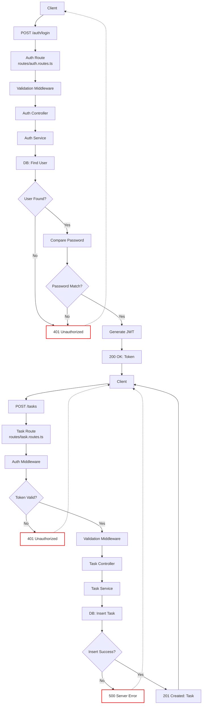

# Task Management flow diagram

This document provides visual flow diagrams for the main processes and data flows in the Product Badges module.
 
---
 
**Note:** These diagrams use [Mermaid](https://mermaid-js.github.io/) syntax. You can preview them in supported Markdown editors,online Mermaid live editors or install https://marketplace.visualstudio.com/items?itemName=bierner.markdown-mermaid

